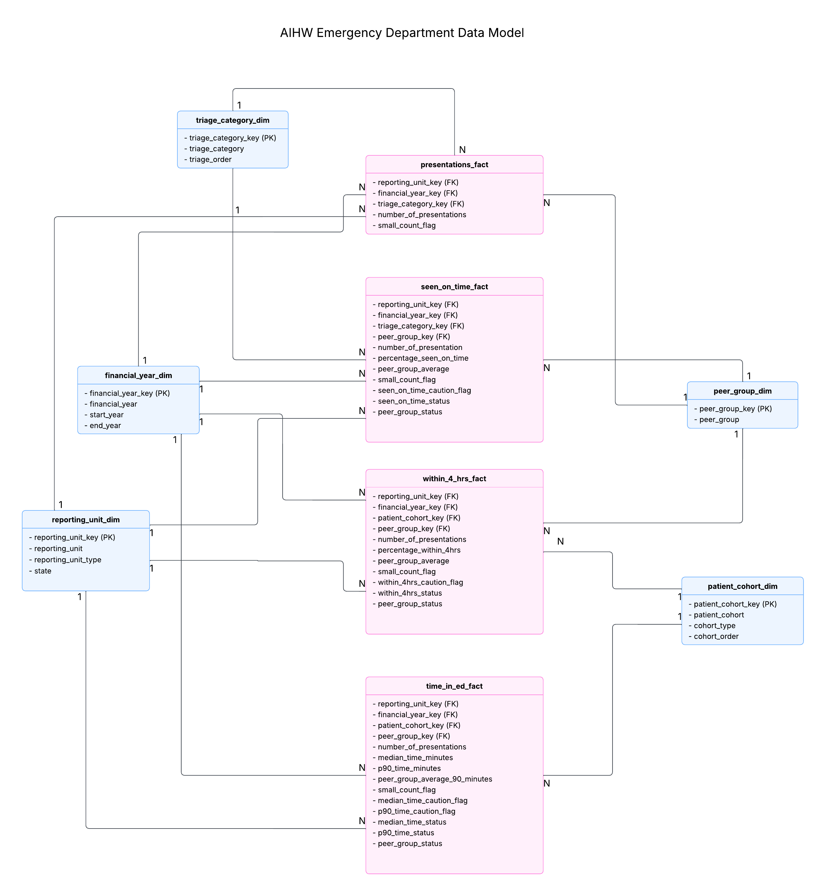

# Australian Emergency Department Analytics

This is an end-to-end analytics project exploring demand and service performance across Australian public hospital emergency departments using publicly available data from the Australian Institute of Health and Welfare (AIHW).

The project combines Python, PostgreSQL, SQL and Power BI to transform raw hospital data into a structured analytical model and interactive dashboard. It examines how emergency department demand has changed over time, how activity and performance vary across states and hospitals, and how individual hospitals compare with peer-group benchmarks.


## Project Overview

This project was developed to demonstrate an end-to-end analytics workflow, including:

- data profiling, cleaning and validation in Python
- dimensional data modelling
- relational data storage in PostgreSQL
- analytical querying in SQL
- interactive reporting and visualisation in Power BI
- interpretation of operational trends and performance differences

The analysis is descriptive and diagnostic, it is intended to identify patterns and differences in emergency department activity and performance. 

## Problem Statement
Australian public hospital emergency departments manage millions of patient presentations each year, with demand and service performance varying across jurisdictions, hospitals, triage categories and patient cohorts.

Understanding these patterns can help answer questions such as where demand is highest, how service performance has changed over time, and whether individual hospitals perform differently from comparable peer facilities.

This project develops a structured analytics solution to explore these questions using historical AIHW emergency department data from 2011–12 to 2024–25.


## Business Questions

The project focuses on the following analytical questions:

1. How has emergency department demand changed nationally over time?
2. How does ED demand vary across states, hospitals and triage categories?
3. How has service performance changed over time?
4. How does service performance vary across triage categories and patient cohorts?
5. Which hospitals record the highest ED presentation volumes?
6. How do individual hospitals compare with their peer-group benchmarks?
7. Is higher ED demand associated with changes in within-four-hours performance or time spent in the ED?


## Why This Analysis Matters

Emergency departments are under ongoing pressure from high patient demand and limited resources. By bringing together demand, waiting-time and time-in-ED measures, this project helps make performance patterns easier to explore across different states, hospitals and patient groups.

The analysis can help identify where demand is increasing, where service performance may be under pressure, and where individual hospitals differ from similar peer hospitals. These insights could support further investigation and help hospital managers or health-service planners understand which areas may need more attention.

This project does not aim to recommend specific operational or clinical changes, as the dataset does not include factors such as staffing, bed availability or patient complexity. Instead, it provides a structured way to identify patterns and areas that may be useful for further analysis.


## Data Source

The project uses publicly available emergency department data from the AIHW.

Source: [AIHW – Emergency departments](https://www.aihw.gov.au/hospitals/topics/emergency-departments)


- **Presentations** – emergency department presentation volumes by reporting unit, financial year and triage category
- **Patients seen on time** – percentage of patients seen within recommended triage timeframes
- **Time in ED – within 4 hours** – percentage of patients departing the emergency department within four hours
- **Time in ED** – median and 90th percentile time spent in the emergency department

The dataset includes multiple reporting levels, including hospitals, Local Hospital Networks, states and national aggregates. These reporting levels overlap and therefore should not be summed together.

The source also contains publication-status codes, caution flags, suppressed small counts and peer-group benchmark information. These were retained during data preparation so that missing or unavailable values could be distinguished from genuine zero values.

For additional details, see:

- `docs/data_dictionary.md`
- `docs/data_quality_notes.md`


## Project Workflow
The project follows an end-to-end analytics workflow:

```text
AIHW Excel Workbook
        |
Python Data Profiling
        |
Data Cleaning and Validation
        |
Dimensional Data Modelling
        |
Processed CSV Files
        |
PostgreSQL Database
        |
SQL Validation and Analysis
        |
Power BI Dashboard
        |
Business Insights and Interpretation
```


## Data Preparation and Quality

The raw AIHW workbook required several cleaning and validation steps before it could be used for analysis.

Python was used to:

- remove non-data header rows from each worksheet
- standardise column names and text formatting
- normalise state abbreviations
- convert numeric fields to appropriate data types
- parse time values into minutes for analysis
- retain publication-status and caution information
- distinguish suppressed small counts from genuine zero values
- identify records where peer-group benchmarks were unavailable
- validate the consistency of cleaned outputs before modelling

Several data-quality rules were important during preparation:

- values reported as `<5` were treated as suppressed counts rather than zero
- publication-status values such as `NP` and `NP†` were retained instead of being converted to numeric values
- caution flags were preserved where missing or invalid timing data affected reliability
- reporting levels such as Hospital, Local Hospital Network, State and National were treated separately because they represent overlapping aggregates
- hospital coverage varies across financial years, so missing historical records do not necessarily indicate zero activity
- peer-group benchmarks are not available for all hospitals or reporting periods

Cleaned datasets were exported to `data/processed/` and subsequently transformed into a dimensional model for loading into PostgreSQL.


## Data Model

The cleaned data was transformed into a dimensional model designed for analytical querying and Power BI reporting.

The model follows a star-schema structure with four fact tables and five shared dimensions.

### Fact Tables

- **`presentations_fact`**  
  Stores emergency department presentation volumes by reporting unit, financial year and triage category.

- **`seen_on_time_fact`**  
  Stores seen-on-time performance by reporting unit, financial year and triage category, together with peer-group benchmark and publication-status information.

- **`within_4_hrs_fact`**  
  Stores the percentage of patients departing the emergency department within four hours by reporting unit, financial year and patient cohort.

- **`time_in_ed_fact`**  
  Stores median and 90th percentile time in ED by reporting unit, financial year and patient cohort.

### Dimension Tables

- **`reporting_unit_dim`** – reporting unit name, reporting level and state
- **`financial_year_dim`** – financial year and corresponding start/end years
- **`triage_category_dim`** – triage category and display order
- **`patient_cohort_dim`** – patient cohort, cohort type and display order
- **`peer_group_dim`** – hospital peer-group classification

Shared dimensions allow measures from different fact tables to be analysed consistently across reporting units, financial years, triage categories, patient cohorts and peer groups.

The reporting hierarchy was intentionally not flattened into a single aggregate because Hospital, Local Hospital Network, State and National records represent overlapping reporting levels and should not be summed together.

A separate dimensional model was created before loading the data into PostgreSQL so that the database structure matched the analytical model later used in Power BI.

### Schema




## Exploratory Data Analysis

Exploratory analysis was carried out in Python before the data was loaded into PostgreSQL and Power BI.

The EDA focused on understanding the structure, coverage and quality of the AIHW emergency department data, including:

- reporting-unit coverage across financial years
- distribution of ED presentation volumes
- differences across states and reporting levels
- presentation volumes across triage categories
- availability of seen-on-time and within-four-hours measures
- median and 90th percentile time spent in the ED
- differences across patient cohorts
- availability of peer-group benchmarks
- missing, suppressed and unpublished values

The analysis also identified several modelling considerations:

- hospital coverage changes over time, so longitudinal comparisons require caution
- reporting levels overlap and should be analysed separately
- missing values may represent unavailable or unpublished data rather than zero activity
- peer-group benchmarks are not available for every hospital and financial year
- service-performance measures are reported at different grains across the source tables

These findings informed the subsequent data-cleaning rules, dimensional model and SQL validation checks.

### Python Workflow

The Python workflow is organised into three notebooks:

1. `notebooks/01_data_profiling.ipynb` – source inspection, structure and data-quality assessment
2. `notebooks/02_data_cleaning.ipynb` – cleaning, standardisation and validation
3. `notebooks/03_data_modelling.ipynb` – dimensional modelling and creation of fact and dimension tables


## SQL Analysis

### PostgreSQL Database

After cleaning and dimensional modelling in Python, the processed fact and dimension tables were loaded into a PostgreSQL database named `australian_ed_analytics`.

The database contains:

- 5 dimension tables
- 4 fact tables
- analytical SQL views used to simplify downstream querying

The dimensional structure in PostgreSQL mirrors the analytical model used later in Power BI.

Before analysis, SQL validation checks were performed to confirm:

- expected row counts after loading
- valid foreign-key relationships between fact and dimension tables
- no orphaned dimension keys
- percentage measures remained within valid ranges
- 90th percentile time in ED was greater than or equal to median time
- nullable peer-group keys were consistent with records where peer benchmarking was not applicable

The SQL scripts are organised in execution order:

1. `sql/01_create_tables.sql` – creates the PostgreSQL schema
2. `sql/02_load_data.sql` – loads the processed CSV files
3. `sql/03_validation_queries.sql` – validates row counts, relationships and measure ranges
4. `sql/04_create_views.sql` – creates analytical views
5. `sql/05_analysis_queries.sql` – contains the main analytical queries

### Analytical Views

Four analytical views were created to combine fact tables with their relevant dimensions and provide analysis-ready outputs:

- `vw_presentations_trend`
- `vw_seen_on_time_performance`
- `vw_within_4hrs_performance`
- `vw_time_in_ed_performance`

These views preserve the grain of the underlying fact tables while exposing descriptive fields such as reporting unit, state, financial year, triage category and patient cohort.

### SQL Analysis

SQL was used to investigate the main business questions before the Power BI dashboard was developed.

The analysis covered:

- national ED presentation trends and year-on-year growth
- demand trends by triage category
- differences in presentation volumes across states
- ranking hospitals by ED presentation volume
- national and state-level seen-on-time performance
- within-four-hours performance by patient cohort
- median and 90th percentile time-in-ED trends
- hospital performance compared with peer-group benchmarks
- exploratory relationships between ED demand and service-performance measures

The SQL analysis also examined whether increasing ED presentation volumes were associated with changes in time spent in the ED.

Across the 14 national annual observations, ED presentation volume showed a positive association with:

- median time in ED
- 90th percentile time in ED

These relationships were treated as exploratory associations rather than evidence of causation.


## Power BI Dashboard

The Power BI report provides an interactive view of emergency department demand, service performance and peer benchmarking.

The report is organised into four pages:

### 1. Overview

The Overview page summarises national emergency department activity and service performance, including:

- total ED presentations
- year-on-year presentation growth
- percentage of patients departing ED within four hours
- median time spent in the ED
- long-term national demand trends
- within-four-hours performance trends
- median and 90th percentile time-in-ED trends

### 2. Demand Analysis

The Demand Analysis page examines where emergency department activity is concentrated, including:

- ED presentations by state
- top hospitals by presentation volume
- presentations by triage category
- state-level demand trends over time

### 3. Service Performance

The Service Performance page explores differences in emergency department timeliness and length-of-stay measures, including:

- seen-on-time performance by triage category
- within-four-hours performance by patient cohort
- median and 90th percentile time in ED by patient cohort
- within-four-hours performance across states
- the relationship between national ED demand and median time in ED

### 4. Peer Benchmarking

The Peer Benchmarking page compares individual hospitals with available AIHW peer-group benchmarks, including:

- seen-on-time performance versus peer benchmark
- within-four-hours performance versus peer benchmark
- 90th percentile time in ED versus peer benchmark
- difference from peer benchmark for seen-on-time performance

The dashboard also displays explanatory messages when historical data or peer benchmarks are unavailable rather than treating missing values as zero.

### Report Files

- [Power BI report](powerbi/australian-ed-analytics.pbix)
- [View exported Power BI report](reports/australian-ed-analytics.pdf)


## Key Findings and Answers to Business Questions

### 1. How has emergency department demand changed nationally over time?

National ED demand increased substantially across the reporting period.

In 2024–25, Australian public hospital emergency departments recorded approximately 9.09 million presentations, representing 0.84% year-on-year growth. The national trend shows a clear long-term increase in presentation volume from 2011–12 to 2024–25.

### 2. How does ED demand vary across states, hospitals and triage categories?

ED demand is unevenly distributed across jurisdictions.

In 2024–25, New South Wales recorded the highest presentation volume at approximately 3.2 million, followed by Victoria at 2.0 million and Queensland at 1.8 million.

Hospital-level demand also varies considerably. Within Victoria, the highest-volume hospitals in 2024–25 included The Northern Hospital, Sunshine Hospital and Monash Medical Centre.

Demand also differs across triage categories. In Victoria in 2024–25, Urgent presentations were the largest category at approximately 2.6 million, followed by Semi-Urgent at 1.9 million and Emergency at 1.0 million.

### 3. How has service performance changed over time?

National service performance has weakened in more recent years.

The proportion of patients departing ED within four hours reached 53.0% nationally in 2024–25, after being higher during the middle of the reporting period.

At the same time, national median and 90th percentile time in ED increased in more recent years, indicating that patients were generally spending longer in emergency departments.

### 4. How does service performance vary across triage categories and patient cohorts?

Performance varies substantially across both triage categories and patient cohorts.

For Victoria in 2024–25, seen-on-time performance ranged from 67.6% for Emergency and 68.9% for Urgent presentations to 100% for Resuscitation and 90.2% for Non-Urgent presentations.

Within-four-hours performance also differed by patient cohort. In Victoria, 56.4% of all patients departed within four hours, compared with lower rates for several higher-acuity cohorts.

Patients who were subsequently admitted spent substantially longer in the ED. Their median time was 342 minutes, compared with 191 minutes for patients who were not subsequently admitted. The corresponding P90 values were 924 minutes and 443 minutes.

### 5. Which hospitals record the highest ED presentation volumes?

Hospital presentation volumes vary substantially within states.

For Victoria in 2024–25, the largest recorded presentation volumes were observed at hospitals including The Northern Hospital, Sunshine Hospital and Monash Medical Centre, each handling roughly 0.1 million or more ED presentations.

The dashboard allows these rankings to be explored dynamically by state and financial year.

### 6. How do individual hospitals compare with their peer-group benchmarks?

Peer benchmarking highlights meaningful differences between individual hospitals and comparable peer facilities.

For example, Monash Medical Centre [Clayton] in 2024–25 recorded:

- 89% seen on time for Urgent presentations versus a 58% peer benchmark
- 93% for Semi-Urgent versus 65% for peers
- 63% for Emergency versus a 65% peer benchmark

This shows that a hospital can perform above its peer benchmark for some categories while performing similarly to or below peers for others.

For P90 time in ED, lower values indicate shorter stays. Peer comparisons are not available for every hospital and year, so unavailable benchmarks are explicitly identified rather than treated as zero.

### 7. Is higher ED demand associated with longer time spent in the ED?

The national scatter plot shows a positive relationship between annual ED presentation volume and median time in ED across 2011–12 to 2024–25.

Years with higher presentation volumes generally also show longer median ED times, and the fitted trend line slopes upward.

The separate SQL analysis supports this pattern, with a correlation of approximately 0.75 between national ED presentations and median time in ED, and approximately 0.63 between presentations and P90 time in ED.

These relationships are exploratory and observational. They indicate association, not causation, and other operational, demographic or system-level factors may also influence ED performance.


## Limitations

Several limitations should be kept in mind when interpreting the results:

- **Changing reporting coverage:** Not all hospitals appear in every financial year, so missing historical records do not necessarily mean there were no ED presentations.
- **Overlapping reporting levels:** The dataset includes Hospital, Local Hospital Network, State and National records. These levels overlap, so they should not be added together.
- **Suppressed and unpublished values:** Some small counts and performance measures are suppressed or not published. These were kept as missing values instead of being treated as zero.
- **Peer benchmark availability:** Peer-group benchmarks are not available for every hospital, metric or financial year, so some comparisons cannot be made.
- **Different levels of detail across tables:** The source tables do not all use the same level of detail. For example, some measures are grouped by triage category while others are grouped by patient cohort, so care is needed when comparing them.
- **Population size not included:** State comparisons are based on total ED presentations and do not account for differences in population size.
- **Observational analysis:** The relationship between ED demand and service performance is exploratory. A correlation does not mean that higher demand directly caused longer ED stays or poorer performance.
- **Other operational factors are not included:** The dataset does not include factors such as staffing levels, bed availability, hospital capacity or patient complexity, which may also affect ED performance.


## Repository Structure

```text
australian-emergency-department-analytics/
│
├── README.md
├── requirements.txt
├── .gitignore
│
├── data/
│   ├── raw/          # local only, not tracked
│   ├── interim/      # local only, not tracked
│   └── processed/    # local only, not tracked
│
├── docs/
│   ├── data_dictionary.md
│   ├── data_model.md
│   ├── data_quality_notes.md
│   ├── project_proposal.md
│   └── Proposed_Data_Model.png
│
├── notebooks/
│   ├── 01_data_profiling.ipynb
│   ├── 02_data_cleaning.ipynb
│   └── 03_data_modelling.ipynb
│
├── powerbi/
│   └── australian-ed-analytics.pbix
│
├── reports/
│   └── australian-ed-analytics.pdf
│
├── sql/
│   ├── 01_create_tables.sql
│   ├── 02_load_data.sql
│   ├── 03_validation_queries.sql
│   ├── 04_create_views.sql
│   └── 05_analysis_queries.sql
│
└── src/
```

- **`data/`** – local working directories for raw, intermediate and processed data. Dataset files are excluded from Git and should be downloaded/generated locally.
> **Note:** Raw and processed data files are not included in this repository. The source dataset can be downloaded from the AIHW website and recreated locally by running the project notebooks.


## How to Run the Project

### 1. Clone the repository

```bash
git clone <https://github.com/joannelu1213/australian-emergency-department-analytics>
cd australian-emergency-department-analytics
```

### 2. Set up the Python environment

Install the required packages

```bash
pip install -r requirements.txt
```

### 3. Download the source data
Download the emergency department dataset from the Australian Institute of Health and Welfare (AIHW):

https://www.aihw.gov.au/hospitals/topics/emergency-departments


Place the downloaded Excel workbook in:

`data/raw/`

### 4. Run the Python notebooks

Start Jupyter:
```bash
jupyter notebook
```
Run the notebooks in the following order:

`notebooks/01_data_profiling.ipynb`
`notebooks/02_data_cleaning.ipynb`
`notebooks/03_data_modelling.ipynb`

The notebooks profile the raw data, clean and validate the source tables, and create the fact and dimension tables used for later analysis.

The final processed CSV files are saved in:

`data/processed/`

### 5. Set up PostgreSQL
Create a PostgreSQL database named:

`australian_ed_analytics`

Run the SQL scripts in the following order:

`sql/01_create_tables.sql`
`sql/02_load_data.sql`
`sql/03_validation_queries.sql`
`sql/04_create_views.sql`
`sql/05_analysis_queries.sql`

### 6. Open the Power BI report

Open the .pbix file in the `powerbi/`folder using Power BI Desktop.

The report uses imported PostgreSQL tables. Depending on the local setup, the PostgreSQL server connection and login credentials may need to be updated before refreshing the report.

A static PDF export of the dashboard is also available in the `reports/` folder for users who do not have Power BI Desktop. The PDF preserves the report layout and visuals but does not include interactive features such as slicers, filtering or tooltips.


## Tools and Technologies

- **Python** – data profiling, cleaning, validation and dimensional modelling
- **pandas** – data transformation and preparation
- **Jupyter Notebook** – exploratory analysis and development workflow
- **PostgreSQL** – relational data storage
- **SQL** – validation, analytical views and business-question analysis
- **Power BI** – interactive dashboard development and reporting
- **DAX** – calculated measures, dynamic titles and dashboard logic
- **Git & GitHub** – version control and project documentation
- **Excel / openpyxl** – reading and processing the original AIHW workbook


## Future Improvements

There are several aspects this project could be improved in the future:

- **Add population-based comparisons:** Use population data to compare ED presentations per person instead of only using total presentation numbers.

- **Include more hospital information:** Add factors such as hospital size, bed numbers or staffing levels if this data becomes available.

- **Explore demand and performance further:** Look more closely at how changes in ED demand are related to waiting-time performance and time spent in the ED.

- **Improve peer comparisons:** Add more ways to compare hospitals with similar peer groups and highlight where hospitals perform better or worse than the benchmark.

- **Add maps:** Use geographic visualisations to show how ED demand and performance differ across states or hospital locations.

- **Automate more of the workflow:** Move some of the notebook steps into reusable Python scripts so future data updates are easier to process.

- **Make the dashboard easier to access:** Explore options for publishing the dashboard online so users can interact with it without needing Power BI Desktop.

- **Add future data:** Update the project when new AIHW emergency department data becomes available.